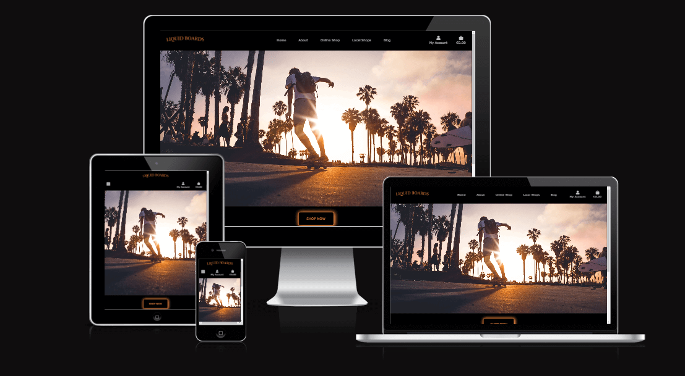

# Liquid Boards

Liquid Boards is a website for a fictitious online skateshop. The site functions as an e-commerce platform allowing Liquid Boards to sell Skateboards, Longboards, Surfskates and skate equipment. The site allows Liquid Boards to display their local physical shops and to post Blog posts to engage their community.
Users are able to sign up to create their own personal account where they can save their address/billing information for easier purchasing at checkout, post a review of a product or comment on a Blog.

View the live site here [Liquid Boards](https://liquid-boards.herokuapp.com/)

## Design

### User Experience (UX)
- The user experience (UX) and user interface (UI) was considered from the start of the design process. 
- The site aims to give the user an enjoyable experience whilst easily and intuitively navigating and interacting with the site on mobile, tablet, laptop or desktop devices.

### Colour scheme

- Adobe colour was used to extract the warm sunset colour #F2913D from the landing page image and was chosen as the color for the site logo, call to action button on the homepage and was interspersed throughout the site.
- A black background for the navbar frames each page of the site and gives a premium feel and helps to contrast the warm sunset coloring in the site.
- Adobe colour was also used to extract #F2F2F2 from the landing page image and is used as a light background color for the body of pages throughout the site.

[Back to top](#Liquid-Boards)

### Wireframes

- [Balsamiq](https://balsamiq.com/wireframes/) was used to create wireframes for [mobile](README/wireframe_mobile.md) and [desktop](README/wireframe_desktop.md) devices.

## Features

### The Nav Bar
- The navbar sits at the top each page with a black background and grey text 
    - A first time vistor or a user that has not signed into the site - Visitor navbar
    - A site member who has signed in - Members navbar
    - an admin user who has signed in - Admin navbar