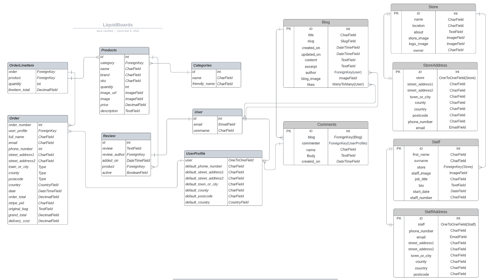
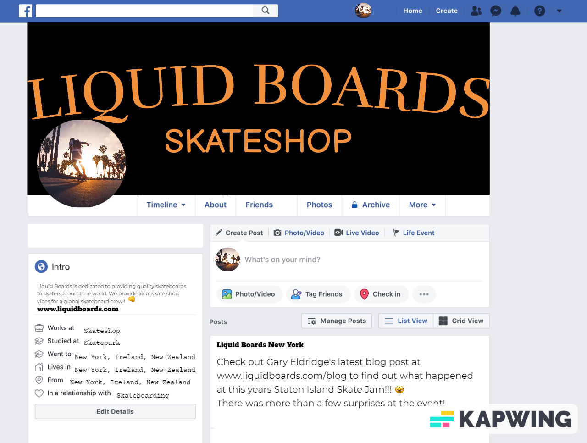

- [Liquid Boards](#liquid-boards)
  * [Design](#design)
    + [User Experience (UX)](#user-experience--ux-)
    + [Colour scheme](#colour-scheme)
    + [Wireframes](#wireframes)
  * [Features](#features)
    + [The Nav Bar](#the-nav-bar)
    + [Desktop Navbar](#desktop-navbar)
    + [Mobile Navbar](#mobile-navbar)
    + [The landing page](#the-landing-page)
    + [The footer](#the-footer)
    + [About Page](#about-page)
    + [Online Shop](#online-shop)
    + [Product Detail Page](#product-detail-page)
    + [Product Reviews](#product-reviews)
    + [Review Form](#review-form)
    + [Edit Review Form](#edit-review-form)
    + [Local Shops](#local-shops)
    + [Local Shop Details](#local-shop-details)
    + [Meet the Team](#meet-the-team)
    + [Shop Address/Contact](#shop-address-contact)
    + [Blog](#blog)
    + [Blog Post](#blog-post)
    + [Blog Comments](#blog-comments)
    + [Blog Comment form](#blog-comment-form)
    + [Edit Blog Comment](#edit-blog-comment)
  * [Future Features](#future-features)
  * [Data Model](#data-model)
  * [Agile Development](#agile-development)
  * [Epics](#epics)
  * [User Stories](#user-stories)
  * [Testing](#testing)
  * [Business model](#business-model)
  * [Web Marketing](#web-marketing)
    + [Content Marketing](#content-marketing)
    + [Blog](#blog-1)
    + [Newsletter](#newsletter)
    + [Facebook](#facebook)
    + [SEO](#seo)
    + [Keywords](#keywords)
  * [Technologies Used](#technologies-used)
    + [Languages](#languages)
    + [Frameworks](#frameworks)
    + [Database](#database)
    + [Other Technologies](#other-technologies)
  * [Deployment](#deployment)
  * [Deployment](#deployment-1)
    + [Local Environment](#local-environment)
  * [Cloning](#cloning)
  * [Forking](#forking)
  * [Credits](#credits)
  * [Acknowledgements](#acknowledgements)

# Liquid Boards

Liquid Boards is a website for a fictitious online skateshop. The site functions as an e-commerce platform allowing Liquid Boards to sell Skateboards, Longboards, Surfskates and skate equipment. The site allows Liquid Boards to display their local physical shops and to post Blog posts to engage their community.
Users are able to sign up to create their own personal account where they can save their address/billing information for easier purchasing at checkout, post a review of a product or comment on a Blog.

View the live site here [Liquid Boards](https://liquid-boards.herokuapp.com/)

## Design

### User Experience (UX)
- The user experience (UX) and user interface (UI) was considered from the start of the design process. 
- The site aims to give the user an enjoyable experience whilst easily and intuitively navigating and interacting with the site on mobile, tablet, laptop or desktop devices.

### Colour scheme

- Adobe colour was used to extract the warm sunset colour #F2913D from the landing page image and was chosen as the color for the site logo, call to action button on the homepage and was interspersed throughout the site.
- A black background for the navbar frames each page of the site and gives a premium feel and helps to contrast the warm sunset coloring in the site.
- Adobe colour was also used to extract #F2F2F2 from the landing page image and is used as a light background color for the body of pages throughout the site.

[Back to top](#Liquid-Boards)

### Wireframes

- [Balsamiq](https://balsamiq.com/wireframes/) was used to create wireframes for [mobile](README/wireframe_mobile.md) and [desktop](README/wireframe_desktop.md) devices.

## Features

### The Nav Bar
- The navbar sits at the top each page with a black background and silver text. 
- The nav link text changes to sunset orange #F2913D when hovered on.
- The Liquid Boards Logo is displayed in the navbar and is a link back to the homepage.
- The shopping bag icon changes color to sunset orange #F2913D if an item has been added.
- The layout and styling give a warm and premium feel to the user experience and allows the user to easily navigate the site.

### Desktop Navbar

- There are dropdown links for the Online Shop menu allowing user to easily access the different categories of products available.

- There are dropdown links for the Local Shops menu allowing user to easily access the different Local Shops available.

### Mobile Navbar

- The navbar is fully responsive and collapses to a hamburger dropdown menu on smaller tablet and mobile screens.

### The landing page

 

- The landing page contains a hero image of a person skatboarding at sunset. 
- The image is warm, inviting and inspiriing to the target audience.
- The main colour in the image is a warm sunset orange, this colour is contrasted with the shadowy silhouette of palm trees and people.
- The hero image is also framed with a black background navbar and footer.
- A call to action "shop now" button is styled with a black background and the same warm sunset orange color for test and shadow effect.
- The shop now button brings the user into the sites online shop.
- The coloring and style effects of the landing page are continued throughout the site giving the user a consistent and intuitive user experience.
- The landing page is responsive for mobile devices.

 

### The footer

 

- The footer is styled with silver text on black backround and sits at the bottom of each page.
- There is a newsletter sign up feature located in the footer.
- The companies social media icon links are in the same color and style as the rest of the site. 
- The icon color changes to silver to grey when hovered on.

### About Page

 

- The About page gives clear messaging to the user about Liquid Boards.
- A strong tagline communicates to the user that Liquid Boards is both an online and local skateshop which is valued in the skate community.
- A brand logo sits at the top of the page on large screens and is removed for mobile screens.

### Online Shop

 

- The products in the online shop are cleanly displayed to the user.
- The page has a light background color and white background on the product cards.
- This allows users to easily see the product image, product name, price, category.
- A search feature is available to the user to search for products on the site.
- A sorting feature allows the user to sort the displayed products. 
- Users can also easily navigate to the different categories within the online shop from the navbar

 

### Product Detail Page

 

- The product details page clearly displays the product details to the user.
- A Keeping shooping option and an Add to Bag option are easily available to the user.
- The layout, styling and functionality of the page lead to a great UX and UI experience for the user.

### Product Reviews

 

- A clean and simple review page is dispalyed below the product details.
- All user of the site can read the reviews which helps potential buyers.
- A user must have account to write a review.
- A user can edit or delete their own reviews if needed.
- An admin user can edit or delete all users reviews if needed.

### Review Form
 
- If a user is signed into their account a review form is displayed for them to easily add review.
- A signed in user will also see an Edit & Delete option for any of their posted reviews.

### Edit Review Form
 
- A signed in user can easily Edit any of their posted reviews.
- A signed in user can easily Delete any of their posted reviews by selecting the Delete button.

### Local Shops

 

- The Local Shops page displays each of the three Liquid Boards shops located in Dublin, New York and New Zealand.

### Local Shop Details

 
- The Shop Details page displays a paragraph about the shop.

### Meet the Team

- The Meet the Team section introduces the user to the shops staff.
- A photo and bio is displayed for each meber of staff.

### Shop Address/Contact

- The local shop contact details are displayed at the bottom of the page.

### Blog

- The site has a blog section allowing the Liquid Board admins to post.
- The site/shop admins can post blog posts from the application backend.
- The blog posts are clearly displayed for the user with a blog image, title, author and excerpt displayed.
- A user that is signed in can like a blog post.
- The Blog styling is consitent with the rest of the sites color scheme and layout which gives a good user experience.

### Blog Post

- A Blog Post page displays the blogs image, title, author and the blog content.
- A thumbs up icon is displayed allowing the user to click/toggle to like the post.
- A chat icon is also displayed with a count of the number of comments the blog has received.

### Blog Comments

- Blog comments are displayed below the blog post.
- A success message is displayed to the user when they have successfully submited a comment.

### Blog Comment form

- A signed in user can add a comment to the blog post by entering text into the comment form and pressing the submit button.

### Edit Blog Comment

- A signed in user can edit or delete their own comment.

[Back to top](#Liquid-Boards)

## Future Features

- Sign in with a Social Media account.
- A wishlist feature to help user track products they would like to purchase.
- A stock management feature.
- A frontend admin feature for the sites blog.

## Data Model

## Agile Development

- Agile methodology was used to manage the developmenet of this project by breaking down the requirements and features for the site into Epics and related user stories. 
- Acceptance criteria's were assingned to each of the user stories.
- A list of software development tasks required to complete the user story objective and meet the acceptence criteria formed the steps of development to be carried out.

## Epics

[EPIC 1: Viewing and navigation](https://github.com/DaveCaulfield/liquid-boards/issues/26)

[EPIC 2: Account Registration & Login](https://github.com/DaveCaulfield/liquid-boards/issues/27)

[EPIC 3: Search & Sort products ](https://github.com/DaveCaulfield/liquid-boards/issues/28)

[EPIC 4: Purchasing & Checkout](https://github.com/DaveCaulfield/liquid-boards/issues/29)

[EPIC 5: Site Administration](https://github.com/DaveCaulfield/liquid-boards/issues/30)

[EPIC 6: Engaging with the community](https://github.com/DaveCaulfield/liquid-boards/issues/32)

## User Stories

As a site visitor 
- I can navigate the site easily and intuitively so that I can easily find my way around the site.
- I can view a display of the products so that I can easily see and select from the displayed products.
- I can view a category of products so that I can easily see a type of product that I am interested in.
- I can view an individual product so that I can see the product details.
- I can easily see the total price of my shopping cart so that I can watch out for how much I'm spending.
- I can see reviews left for products so that I can see other peoples thoughts and experiences of products.
- I can create an account so that I can save my details for an easier shopping experience.
- I can login to my account so that I can view/edit my account information.
- I can have a personalized profile so that I can view my order history and save billing information.
- I can reset my password so that I can access my account.
- I can search products so that I can easily find products I'm interested in.
- I can view and sort search results so that I can easily organize my search results.
- I can sort a category of product so that I can easily sort items by price or brand.
- I can add an item to my shopping cart so that I can purchase an item.
- I can select the quantity of an item to purchase so that I can adjust the amount of items I would like.
- I can view the items in my shopping bag so that I can view the no of items and total cost.
- I can add my details so that I make a purchase easily.
- I can view my order so that I can ensure there are no mistakes with the order.
- I can get confirmation of my purchase so that I can keep record of my purchases
- I can leave a review of a product I purchased so that I can help others with deciding on their purchase.
- I can edit my product reviews so that I can make edits to my reviews if required.
- I can delete my product reviews so that I can remove my reviews if required.
- I can add, edit and delete my own blog comments so that I can engage with the sites blog.

As a site Admin
- I can add a product so that I can add items to the online shop.
- I can edit a product so that I can update item details.
- I can delete a product so that I can remove items from the shop.
- I can add a shop to the site so that I can add any new shops that come on board or are opened.
- I can edit a shops details so that I can make edits if required.
- I can delete a shop from the site so that I can remove a shop if needed.
- I can add, edit delete staff so that I can update staff details as required.
- I can upload, edit and delete Blog Posts so that I can upload and manage blog posts.

- Githubs project kanban feature was used for easy tracking of user stories.
- A template was created for adding the user stories which populated them as issue into the To Do column of the kanban board.
- Epics were created grouping the user stories into categories.
- Acceptence criteria was defined for each user story.
- User stories were moved into the In Progress column while being worked on.
- Once all tasks belonging to a user story were completed and the acceptence criteria was met the user story was moved into the Done Column.

[Back to top](#Liquid-Boards)

## Testing

Please see the [Testing](testing.md) page for details of site testing. 

## Business model
- The Liquid Boards site is created as a B2C site, it's purpose is to sell skateboards and skate equipment and promote the local skateshops. 
- The sites strategy is to create a skate community in which people feel welcomed and the site is trusted by the community. 
- This helps create the site as the go to place for skateboards and helps create a sustainable repeat customer base.
- The ways of implementing this strategy are listed below in the Web Marketing section.

## Web Marketing
- Web marketing is the process of marketing a business online, and it's a cost-effective way to reach people who are most interested in what your business has to offer. 
- The site uses SEO and Content Marketing to helps create the community.

### Content Marketing
- Content marketing is the process of consistently creating, distributing and promoting relevant online materials in a way that is strategically designed to attract, engage and convert your target market into customers. 

### Blog
- The site has a Blog feature which the shop owners can upload relevant and interesting blogposts to. 
- There is a comments are for users to add comments which creates further engagement with the community.

### Newsletter
- The site has a Newsletter feature allowing users to signup to keep updated on any offers.

### Facebook
- The site is a fictitious site so a Facebook mockup has been created to show the social media strategy.

### SEO
- A sitemap.xml and a robots.tx file have been created for the site.

- The xml sitemap is a file that lists a website’s important page urls, making sure that search engines can crawl, or navigate, through them. 
- It also helps search engines understand your website structure and ensures search engines will crawl every essential page on your website which helps with content discovery.

- The robots.txt file is a simple text file that tells search engines where they are not allowed to go on a website. 
- It lists out any folders  or files that will not be crawled or indexed by search engine spiders. 
- Having a robots.txt file shows that you acknowledge that search engines are allowed on your site and that they may have free access to it.
- Search engines take the existence of this  file in your projects as a sign of quality and so it improves your SEO ranking as a result. 

### Keywords
- Keyword research is the process of finding and analyzing search terms that people enter into search engines, with the goal of using that data for SEO or general web marketing.
- Both Short-tail keywords and Long-tail phrases were researched for the target audience.
- Keywords were tried out on Google and the autocomplete and relevant suggestions returned were helpful in narrowing down suitable keywords and long-tail phrases.

- Semantic HTML best parctices were also followed throughout development sucha the the use of header, section, footer and image alt tags.
- Semantic HTML tags are important for SEO because they indicate the role of the content within the tags. Pages with correctly implemented semantic HTML have an advantage in SEO over those that don’t. 
- Rel attributes noopener and noreferrer were also used on any links opening external sites.

## Technologies Used

### Languages
  - python - used to develop the backend of the site.
  - HTML - used to structure webpage layout of website.
  - CSS - used to style webpages.

### Frameworks
 - Django Python Framework - used to create the backend structure for the site.
 - Bootstrap - used to style the website, add responsiveness and interactivity.
 - Django-allauth - used for account authentication.

### Database
- PostgreSQL - used as the deployed sites database.

### Other Technologies
- AWS - used for media hosting service
- Git- used for version control 
- GitHub - used for hosting the code repository
- Heroku - used as the cloud based deployment platform
- Balsamiq - used to create the wireframes
- Chrome DevTools - used for inspecting and debugging the site
- Font Awesome - used to source icons
- Github Projects - used to track user stories progress through the project
- Favicon.io - used for the favicon
- Adode Color - used for the color theme
- Google Sheets - for the database model tables and manual testing

[Back to top](#Liquid-Boards)

## Deployment
 The site was deployed using the Heroku platform.

 The following steps were taken to deploy the site:

 - Log into your Heroku account.
 - From the home dashboard, click on "New" then "Create new app".
 - Enter the "App name" and "Choose a region" before clicking on "Create app".
 - In your apps Resources tab and add a Heroku Postgres database.
 - Go to "Config Vars" under the "Settings" tab.
 - Click on "Reveals Config Vars" and enter:

   - DATABASE_URL = add url of postgres database
   - PORT = 8000
   - SECRET_KEY = secret key for app
   - DISABLE_COLLECTSTATIC = 1 for development. Needs to be removed when deploying to production
 - Go to the Deploy tab and for deployment method select Github and click on "Connect to GitHub"
 - Search for the repository name and click connect
 - Go to the bottom of the deploy page and select preferred deployment type:
 - Choose "Automatic deploys" or "Manual deploys" to deploy the application

 - In Django:
 - Create a procfile. 
 - In settings.py make sure DEBUG is False and add Heroku to ALLOWED_HOSTS
 - create an environment env.py file with database url and secret keys also add Stripe and AWS secret keys for production.

 ### Local Environment

 - Create a workspace on your local IDE or use gitpods cloud based virtual enviroment.
 - Create an env.py file with variables for database url, secret key, media storage url
 - follow the steps above for setting up heroku.

 

 ## Cloning
 To clone the repository:
 - Go to the sites main page in Github.
 - Select the Code drop down button (beside the green gitpod button)
 - Go to the GitHub CLI tab and click on the copy icon
 - Open a bash terminal
 - Change the current working directory to the desired destination location.
 - Type 'git clone' and paste in the copied URL
 - Press enter to create the local clone
 
 An environment env.py file must also be created. env.py files are not stored in GitHub so are not included with the cloned files.
 
  ## Forking

  To fork the project go to the main repository page. At the top right of the page, click the Fork icon. A forked copy of the repository will appear in your Repositories page.

 
 ## Credits

## Acknowledgements

