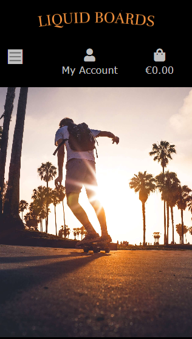

# Liquid Boards

Liquid Boards is a website for a fictitious online skateshop. The site functions as an e-commerce platform allowing Liquid Boards to sell Skateboards, Longboards, Surfskates and skate equipment. The site allows Liquid Boards to display their local physical shops and to post Blog posts to engage their community.
Users are able to sign up to create their own personal account where they can save their address/billing information for easier purchasing at checkout, post a review of a product or comment on a Blog.

View the live site here [Liquid Boards](https://liquid-boards.herokuapp.com/)

## Design

### User Experience (UX)
- The user experience (UX) and user interface (UI) was considered from the start of the design process. 
- The site aims to give the user an enjoyable experience whilst easily and intuitively navigating and interacting with the site on mobile, tablet, laptop or desktop devices.

### Colour scheme

- Adobe colour was used to extract the warm sunset colour #F2913D from the landing page image and was chosen as the color for the site logo, call to action button on the homepage and was interspersed throughout the site.
- A black background for the navbar frames each page of the site and gives a premium feel and helps to contrast the warm sunset coloring in the site.
- Adobe colour was also used to extract #F2F2F2 from the landing page image and is used as a light background color for the body of pages throughout the site.

[Back to top](#Liquid-Boards)

### Wireframes

- [Balsamiq](https://balsamiq.com/wireframes/) was used to create wireframes for [mobile](README/wireframe_mobile.md) and [desktop](README/wireframe_desktop.md) devices.

## Features

### The Nav Bar
- The navbar sits at the top each page with a black background and silver text. 
- The nav link text changes to sunset orange #F2913D when hovered on.
- The Liquid Boards Logo is displayed in the navbar and is a link back to the homepage.
- The shopping bag icon changes color to sunset orange #F2913D if an item has been added.
- The layout and styling give a warm and premium feel to the user experience and allows the user to easily navigate the site.

### Desktop Navbar

- There are dropdown links for the Online Shop menu allowing user to easily access the different categories of products available.

- There are dropdown links for the Local Shops menu allowing user to easily access the different Local Shops available.

### Mobile Navbar

- The navbar is fully responsive and collapses to a hamburger dropdown menu on smaller tablet and mobile screens.

### The landing page

 

- The landing page contains a hero image of a person skatboarding at sunset. 
- The image is warm, inviting and inspiriing to the target audience.
- The main colour in the image is a warm sunset orange, this colour is contrasted with the shadowy silhouette of palm trees and people.
- The hero image is also framed with a black background navbar and footer.
- A call to action "shop now" button is styled with a black background and the same warm sunset orange color for test and shadow effect.
- The shop now button brings the user into the sites online shop.
- The coloring and style effects of the landing page are continued throughout the site giving the user a consistent and intuitive user experience.
- The landing page is responsive for mobile devices.

 

### The footer

 

- The footer is styled with silver text on black backround and sits at the bottom of each page.
- There is a newsletter sign up feature located in the footer.
- The companies social media icon links are in the same color and style as the rest of the site. 
- The icon color changes to silver to grey when hovered on.

