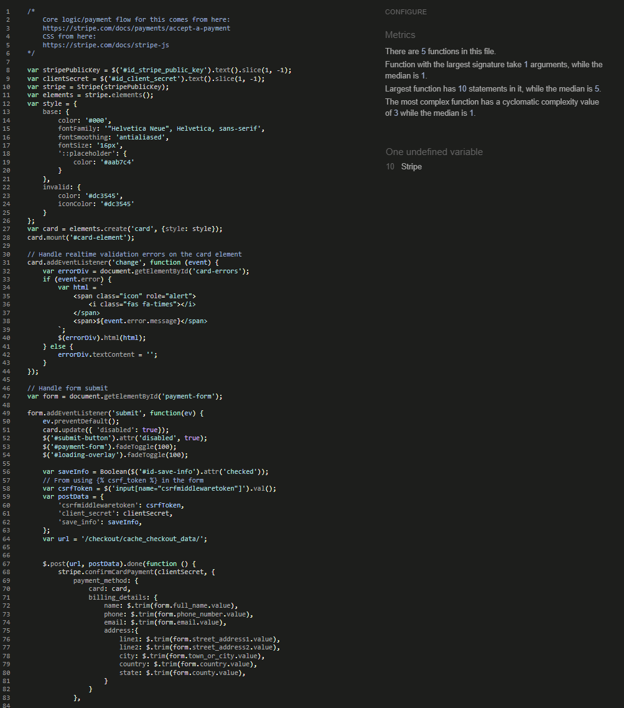
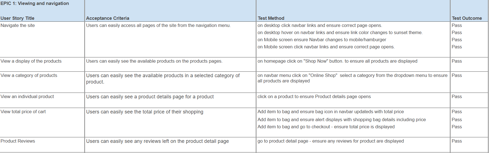
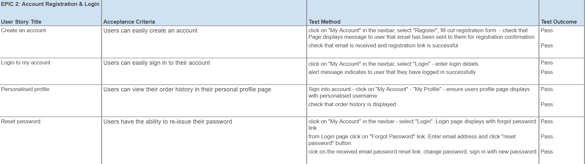
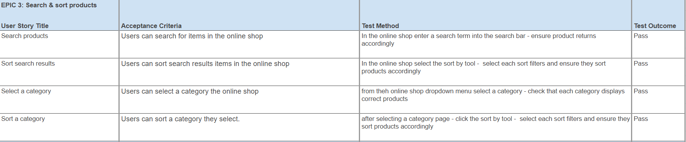
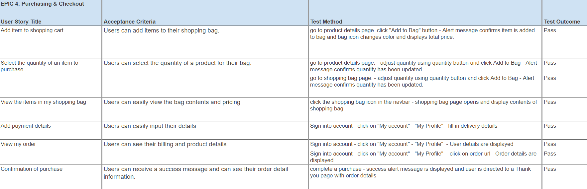
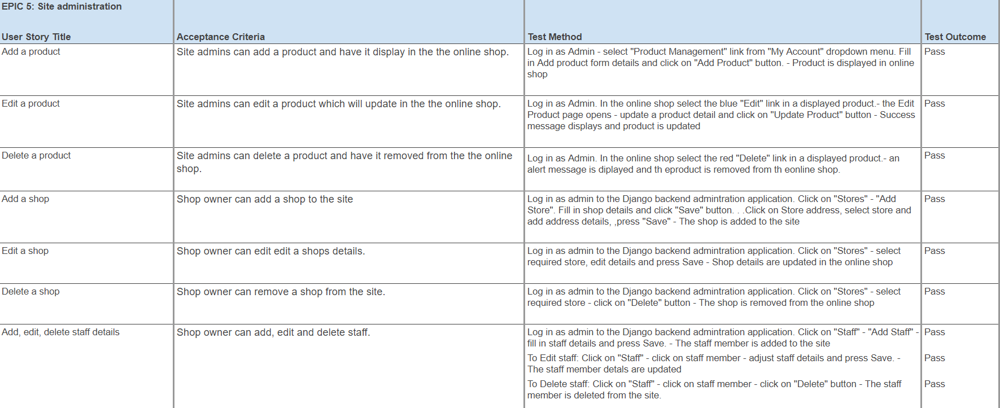
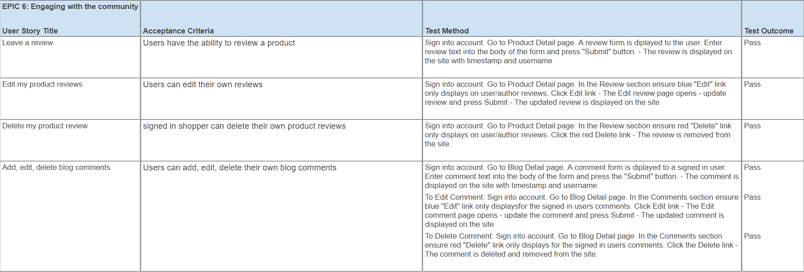
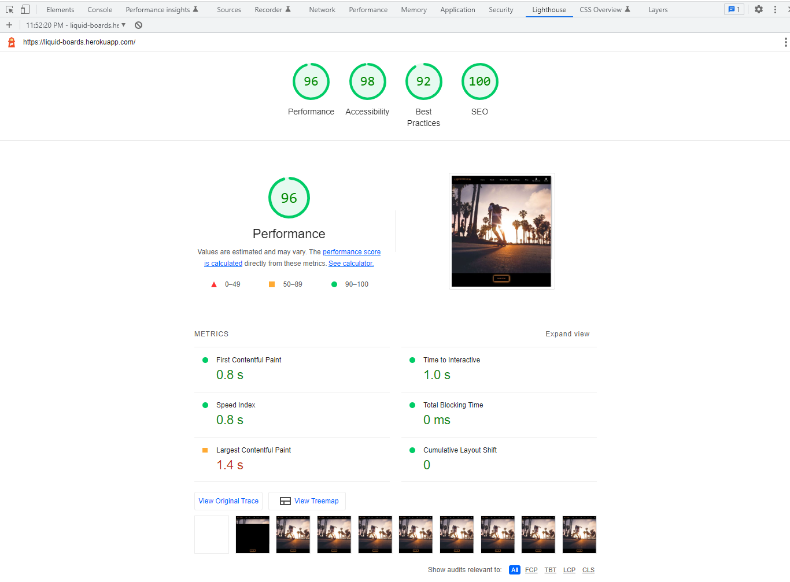

# Testing
- Testing was carried out throughout the development cycle. As each user story was completed acceptance criteria was checked.

- The deployed site was checked for appearance, responsiveness and funcionality to make sure it worked as expected for mobile, tablet, laptop and desktop devices and also for different browser types.

## Code Vaildation
- The code for Liquid Boards has been tested using [W3C HTML Validator](https://validator.w3.org/), [W3C CSS Validator](https://jigsaw.w3.org/css-validator/), [JS Hint](https://jshint.com//) and flake8 lint during development.

### Python validation
- Flake8 was used during development to catch any python code errors or warnings. Issues flaaged such as line too long or whitespace have been fixed. 
- There are lines of code created by Django with warning messages that have not been altered. 

### HTML Vaildation

- There were some minor fixes required after html validator testing found some missing/duplicate end tags.
- All html code writen has passed validation.

### CSS Vaildation

- CSS stylesheets were tested using [W3C CSS Validator](https://jigsaw.w3.org/css-validator/) and showed no errors.

### JS validation

- Javascript files were tested using [JS Hint](https://jshint.com//) and found an undefined variable for Stripe. This script is from Stripe and has been left as is.
- there is also a js script from mailchimp for the sites newsletter that showed up some warnings.

Back to [README.md](README.md)

## Manual Testing

## Responsiveness Testing
- Responsivness was tested using [Google Chrome DevTools](https://developer.chrome.com/docs/devtools/) and [Responsive design checker](https://responsivedesignchecker.com/). 
    - Devices tested using these tools were Moto G4, Galaxy S5, iPhone5, iPhone6/7 iPad, iPad pro, Display < 1200px, Display > 1200px
- Physical devices used in testing were iPhone11, iPad, Laptop and extra large monitor.

## Browser Compatability
- The site was tested using Google Chrome, Microsoft Edge, Mozilla Firefox and Safari web browsers. 
- Testing checked for:
    - Rendering/Appearance
    - Responsiveness
    - Functionality 

Back to [README.md](README.md)

### Lighthouse

- [lighthouse](https://developers.google.com/web/tools/lighthouse) was used to test the site for performance, accessibility, best bractices and SEO.

    - Performance - How fast it takes a webpage to load.
    - Accessibility - How accessible a website is (users might need a screen reader).
    - Best Practices - How the site conforms to coding best practices.
    - SEO - Search engine optimisation. How optimised the site is for search engine results.

Back to [README.md](README.md)