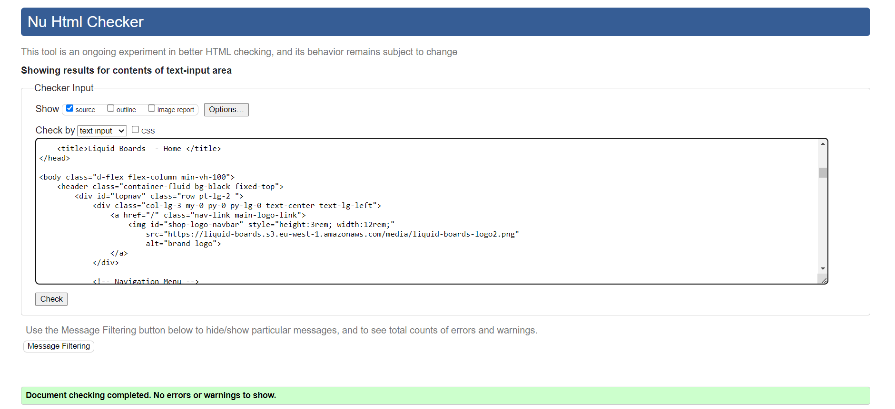
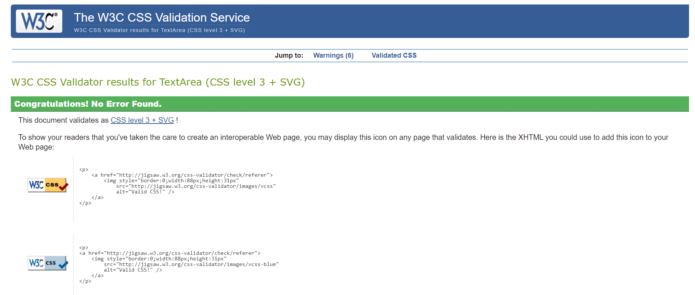

# Testing
- Testing was carried out throughout the development cycle. As each user story was completed acceptance criteria was checked.
- The deployed site was checked for appearance, responsiveness and funcionality to make sure it worked as expected for mobile, tablet, laptop and desktop devices and also for different browser types.

## Code Vaildation
- The code for Liquid Boards has been tested using [W3C HTML Validator](https://validator.w3.org/), [W3C CSS Validator](https://jigsaw.w3.org/css-validator/) and a python Pep8 validator extension during development.

### HTML Vaildation

- There were some minor fixes required after html validator testing.
- All html code writen has passed validation.

### CSS Vaildation

- CSS stylesheets were tested using [W3C CSS Validator](https://jigsaw.w3.org/css-validator/) and showed no errors.